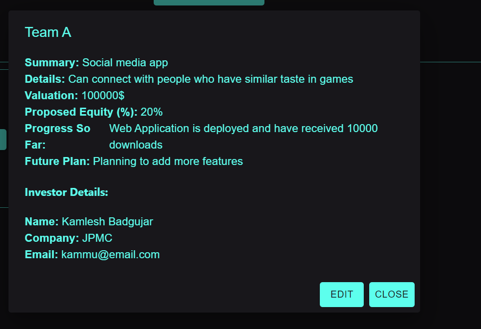

# final-project-proposal-uchiha

**Team Members**: Aditya Nair (664611850),
              Sahaja Peddaveerannagari (6606366326)

**Team Name**: Uchiha  
**Web-Application Name**: PitchDeck  
**Web-Application URL** : https://pitchdeck.onrender.com/

### Expectations: 
1) What does our application do?

Our application is aimed to take care of the end-to-end process involved in finding investors for an idea/project. 
It will make the process easy for both the investor and the founder by providing a platform to pitch ideas (founder) and to find ideas to invest (investor).

2) What makes it different than a CRUD app? I.e., what functionality does it provide that is not just a user interface layer on top of a database of user information, and the ability to view / add to / change that information?

The investor has the right to privacy until he gets certain number of investors onboard to fund the idea/project.
The investment will proceed only if the idea has the potential to get a certain number of investors to fund for it and until the certain number of investors are onboard, the founder will not know any information about the investors or contact them in any way.

3) What security and privacy concerns do you expect you (as developers) or your users to have with this application?

The privacy of the investor is something critical in this application as we do not want the founder to contact the investor until certain number of investors are ready to invest in the idea/ project.

### Flow chart of the Application:

 
### Tech- Stack Information: 

1) What services you will use to host (front end, back end, database)  
We will be using all the three services-frontend, backend, database to host our application.  

2) What technologies you will use on the front end and back end. 
- Frontend- React  
- Backend- Node js  
- Database- Supabase Postgres  

3) What APIs you will call out to?
- CRUD APIs exposed by Supabase  
- APIs to hash the number of investors  

4) USP in the Application:  
We used Crypto-JS library to secure the privacy of the Investor details. If an investor likes the idea, he will fill the dialogue box that asks him the number of investors he requires for him to invest in the idea.
Once it is filled, the Investor details are encrypted and store on database. Post it the application check if any condition is met.
Once the required number of investors criteria is met, it will decrypt the data and stores the details in human-readable format in database which could be viewed in the Fulfilled Pitch tab in the frontend.
### Minimum Viable Product (MVP):

1) Short textual description of MVP.
MVP will consist of frontend development of the pitcher, investor and the CRUD Operations. We will also try to implement Hash functionality. 

2) Implementation (Checkpoint 1):  
We have implemented the following functionalities for Checkpoint 1: 
- User Sign Up. (User will have to login again after sign up) 
- User Log In. 
- Investor can view all Pitches (Ideas proposed by startups). 
- Pitchers can only view the pitch proposed by them. 
- Pitchers can create/edit their pitches. 

3) Implementation for the Final(Final Checkpoint): 
We have implemented the following functionalities for Final Checkpoint: 
- Implemented Accept functionality for Investor. When Investor accepts an idea, it should ideally encrypt their interest and
decrypt it only when desired condition is met. 
- Input Validations.
- UI Design.

### Application Flow:
1. Front-end look 

2. Pitch Created (Role: Pitcher)

3. Investor View

4. Once the investor is interested, he has to fill the dialogue box that has the number of investors he wants onboard to invest in this idea.

(Investor 1)

(Investor 2)

(Investor 3)

5. View if the Investor is interested

6. Condition is met: Required number of Investors are onboard.

This is the view of the pitcher where he can see the details of the Investor.

7. View of the Investor once the required number of Investors are onboard

***Note:*** 
View Investment Button: Only for Development purpose, it won't be shown to the end user when released.

Interested Ideas contain the data which is encrypted when investor is onboard to invest and fills the Invest dialog box

Fulfilled Ideas contain the decrypted data of the investment that met the Investor condition.

